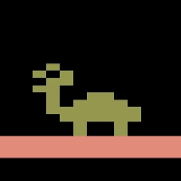
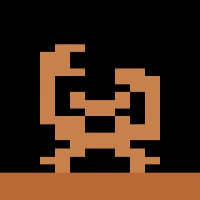
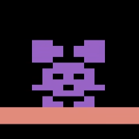
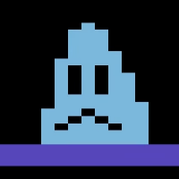
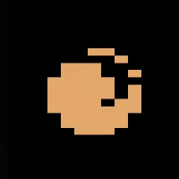
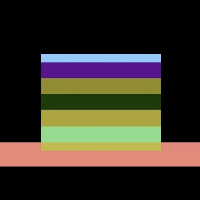

## Game Overview

**Mario Bros.** is a platform game where the player controls the plumbers **Mario (and optionally Luigi)** inside a sewer made of several horizontal platforms. Enemies emerge from pipes, and the goal in each round is to **defeat all enemies to advance to the next round while scoring as many points as possible**.

---

## Player Controls

- The player moves left or right using the joystick.
- Pressing the button makes the character **jump**.
- Jumping while running moves between floors; jumping while standing jumps straight up.

---

## Basic Gameplay

Enemies crawl out of pipes and move along the platforms. The player **cannot jump on enemies directly**. Instead, defeating them requires two steps:

1. **Hit the platform from below** to flip the enemy onto its back.
2. **Kick the flipped enemy off the platform** before it recovers.

When all enemies are removed, the round ends and a **new round with more difficulty** begins.

The screen wraps horizontally: exiting one side makes the character appear on the opposite side.

---

## Enemies and Hazards

Common enemies include:

| Enemy | Sprite | Description |
| --- | --- | --- |
| **Shellcreeper** |  | A turtle that walks along platforms. One hit from below flips it. |
| **Sidestepper** |  | A crab that requires two hits from below before it can be kicked. |
| **Fighter Fly** |  | A jumping insect that bounces across platforms. |
| **Slipice** |  | Freezes floors and makes them slippery. Worth 500 points when punched. |

Additional hazards:

| Hazard | Sprite | Description |
| --- | --- | --- |
| **Fireball** |  | Moves around the screen and must be avoided at all costs. |

---

## POW Block

A **POW block** sits near the bottom center of the stage.

- Hitting it flips all enemies touching the floor.
- It can only be used **three times before disappearing**.

---

## Scoring

Points are earned through several actions:

| Action | Points | Note |
| --- | --- | --- |
| Kick enemy off platform | 800 | |
| Collect bonus wafer  | 800 | Appears after defeating an enemy |
| Collect coin in bonus stage | 800 | |
| Punch the enemy Slipice | 500 | |

Occasionally a **coin phase** occurs where enemies disappear and the player has about **15 seconds to collect hanging coins for points**.

---

## Lives and Game Over

- The player starts with **5 lives** depending on the game variation.
- A life is lost when the character **touches an enemy that is not flipped, a fireball, or other hazards**.
- The game ends when **all lives are lost**.
- **Extra lives are awarded every 20,000 points**.

---