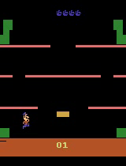

# DQN Atari

<p align="center">
  
  <br>
  <em>Gameplay by a trained DQN agent on Mario Bros</em>
</p>

A modular Deep Q-Network implementation for training agents to play Atari games directly from raw pixel input, using PyTorch and Gymnasium.

## Overview

This project implements the **Double DQN** algorithm to train RL agents on Atari games from the Arcade Learning Environment (ALE). The agent observes raw game frames, preprocesses them into 84x84 grayscale images, and stacks the last 4 frames to capture motion. It learns an action-value function through experience replay and epsilon-greedy exploration, with a target network for stable Q-value estimation.

**Key features:**
- Multi-environment parallel training for faster data collection
- YAML-driven configuration -- swap games, hyperparameters, and paths without touching code
- Mid-training evaluation with optional video capture
- Multi-environment grid-video evaluation to visually compare agent performance across parallel runs
- Single-environment demo mode for live playback or video export

The default configuration trains on **Mario Bros**, but any ALE game can be used by creating a new config file.

### Current Experiment: Mario Bros

The default config targets **Mario Bros** -- a classic platform game where the agent controls Mario inside a sewer with multiple platforms. Unlike most platformers, enemies can't be defeated by jumping on them; instead the agent must learn to hit platforms from below to flip enemies and then kick them off. The game rewards 800 points per enemy defeated, and the agent starts with 5 lives that are lost on contact with unflipped enemies or fireballs. The training setup applies a life-loss penalty to encourage survival alongside score maximisation.

For a detailed breakdown of the game mechanics, scoring, and enemy types, see [Gameplay.md](Gameplay.md).

## Setup

```bash
# Create and activate a virtual environment
python -m venv venv
source venv/bin/activate  # On macOS/Linux

# Install dependencies
pip install -r requirements.txt
```

## Project Structure

```
dqn_atari/
├── model.py        # DQN convolutional network
├── buffers.py      # FrameBuffer, MultiEnvFrameBuffer, MultiEnvReplayBuffer
├── scheduler.py    # Linear epsilon decay scheduler
├── env.py          # Gymnasium environment factory
├── utils.py        # Device selection, video helpers, config loader
├── train.py        # Multi-env training loop
├── evaluate.py     # Multi-env grid-video evaluation
└── demo.py         # Single-env live demo / video export
```

## Configuration

All hyperparameters live in YAML config files under `configs/`. See `configs/mario_bros.yaml` for the full set of options:

- **env**: game name, frameskip, number of parallel envs, action count
- **training**: steps, buffer size, batch size, learning rate, discount, etc.
- **epsilon**: exploration schedule (max, min, exploration fraction)
- **eval**: mid-training eval settings (save video or just log reward)
- **eval_full**: standalone evaluation settings (num envs, grid layout)
- **paths**: where to save checkpoints and videos

## Usage

### Train

```bash
python -m dqn_atari.train --config configs/mario_bros.yaml
```

Override device:

```bash
python -m dqn_atari.train --config configs/mario_bros.yaml --device cuda
```

Checkpoints are saved to `checkpoints/` and training curves to `videos/`.

### Pretrained Weights
Pretrained weights for Mario Bros can be found at [Checkpoints](https://drive.google.com/file/d/1ZoR2gOOGdYi4kdgWtTy8P3tkTMCO7tT2/view?usp=sharing).

### Evaluate

Run multiple environments in parallel and produce a grid video of all gameplays:

```bash
python -m dqn_atari.evaluate \
    --config configs/mario_bros.yaml \
    --checkpoint checkpoints/MarioBros_final.pt
```

Outputs a grid video and per-environment rewards.

### Demo

Watch the agent play live:

```bash
python -m dqn_atari.demo \
    --config configs/mario_bros.yaml \
    --checkpoint checkpoints/MarioBros_final.pt
```

Or save the gameplay as a video:

```bash
python -m dqn_atari.demo \
    --config configs/mario_bros.yaml \
    --checkpoint checkpoints/MarioBros_final.pt \
    --save-video
```

## Adding New Games

Create a new config file (e.g. `configs/breakout.yaml`) with the appropriate `env.name` and `env.num_actions`, then pass it via `--config`.
